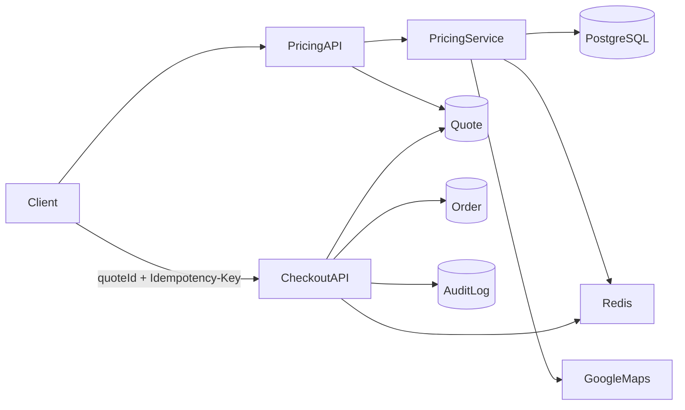

# Phase 2 Enterprise Architecture

## System Components
- API: Node.js + Express + TypeScript
- Data: PostgreSQL via Prisma
- Cache/abuse control: Managed Redis with local fallback
- Realtime: Socket.IO for courier/order events
- Admin UI: React dashboard

## Core Design
- `POST /api/pricing/calculate` creates immutable quote snapshots with `quoteId`, `expiresAt`, `pricingVersion`.
- `POST /api/orders` requires `quoteId` and `Idempotency-Key`, validates quote state, and atomically consumes quote on order creation.
- Pricing data is cached in Redis with scoped keys and TTL, invalidated on admin mutations.
- Admin pricing changes write full audit logs with before/after snapshots.

## Sequence Diagram

## Security Posture
- Strict JWT secret requirement (no insecure fallback).
- Helmet + CORS allowlist + input sanitization + centralized validation.
- Redis-backed endpoint throttling by IP+user identity.

## Scaling Strategy
- Stateless API nodes behind load balancer.
- Managed Redis as shared cache/rate-limit backend.
- Horizontal API scaling with quote/order idempotency guarantees preserved in DB.
